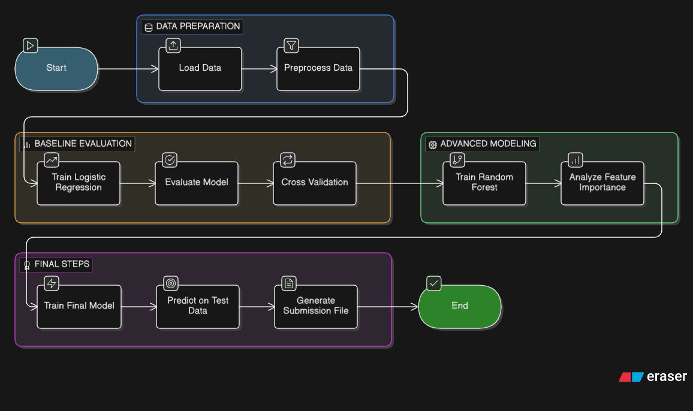

# ML Classification Project

## Problem Statement
The objective of this project is to build a machine learning model capable of accurately classifying data into two categories based on the provided features.

The dataset contains multiple numerical features along with a target variable **Class**. The goal is to learn the underlying patterns in the training data and generate predictions for the unseen test dataset.

---

## Project Pipeline

  

---

## Datasets

### Training Dataset (TRAIN.csv)
- Used for learning the relationship between features and the target variable.
- Contains:
  - Feature columns
  - Target column **Class**

### Test Dataset (TEST.csv)
- Contains feature columns and **ID** column.
- No target variable; predictions are generated for this dataset.

---

## Data Preparation
The dataset was loaded using **Pandas**:

import pandas as pd

train = pd.read_csv("TRAIN.csv")
test = pd.read_csv("TEST.csv")

X = train.drop(columns=["Class"])
y = train["Class"]
Baseline Model: Logistic Regression

Why Logistic Regression?

Simple and interpretable

Provides insight into feature importance

Good baseline for classification problems
from sklearn.linear_model import LogisticRegression

model = LogisticRegression(max_iter=1000)
model.fit(X_train_scaled, y_train)
Model Evaluation

Metrics used:

Accuracy

Precision

Recall

Confusion Matrix

from sklearn.metrics import accuracy_score, precision_score, recall_score, confusion_matrix

accuracy_score(y_val, y_pred)
precision_score(y_val, y_pred)
recall_score(y_val, y_pred)
confusion_matrix(y_val, y_pred)
Handling Class Imbalance
model = LogisticRegression(
    max_iter=1000,
    class_weight="balanced"
)
Feature Importance Analysis
coef = pd.Series(model.coef_[0], index=X.columns)
coef.sort_values(ascending=False).head(10)
Random Forest Model

Random Forest is an ensemble learning method combining multiple decision trees.

from sklearn.ensemble import RandomForestClassifier

rf = RandomForestClassifier(n_estimators=200, random_state=42)
rf.fit(X_train, y_train)

Advantages:

Handles nonlinear relationships

Robust to noise

Performs well on complex datasets

Model Validation
accuracy_score(y_val, y_pred_rf)
confusion_matrix(y_val, y_pred_rf)
Cross Validation
from sklearn.model_selection import cross_val_score

scores = cross_val_score(rf, X, y, cv=5, scoring="accuracy")
Feature Importance from Random Forest
importances = pd.Series(rf.feature_importances_, index=X.columns)
importances.sort_values(ascending=False).head(10)
Final Model Training
rf_final.fit(X, y)
Test Prediction & Submission
test_ids = test["ID"]
X_test = test.drop(columns=["ID"])

predictions = rf_final.predict(X_test)

submission = pd.DataFrame({
    "ID": test_ids,
    "CLASS": predictions
})

submission.to_csv("FINAL.csv", index=False)
Technologies Used

Python

Pandas

Scikit-learn

NumPy

Jupyter Notebook

Models Used
Model	Purpose
Logistic Regression	Baseline model
Random Forest	Final model
Results

The Random Forest model showed strong predictive performance. Metrics included:

Accuracy

Precision

Recall

F1 Score

Project Structure
project/
│
├── TRAIN.csv
├── TEST.csv
│
├── notebook.ipynb
├── FINAL.csv
└── README.md
Future Improvements

Hyperparameter tuning

Gradient Boosting models

XGBoost / LightGBM

Feature engineering

SHAP model explainability

